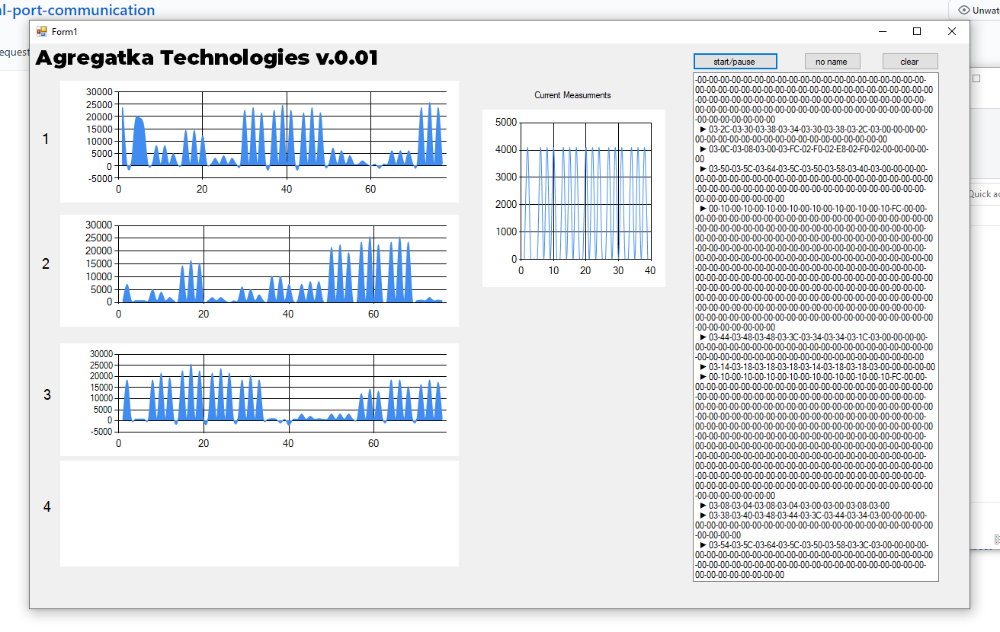

Folder for installation on PC https://github.com/arstagaev/Usb-uart-serial-port-communication/tree/main/WindowsFormsApp7/obj/Release

-> After download this folder, you should run .exe file for installation

<td>  </td> 